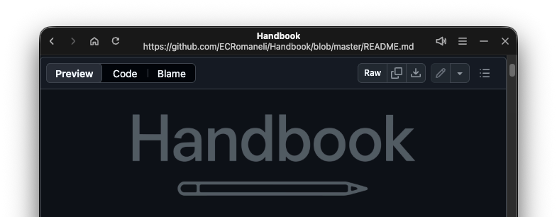
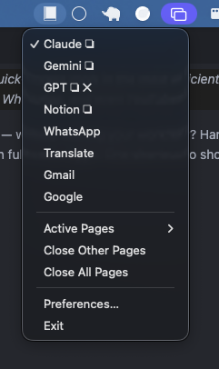
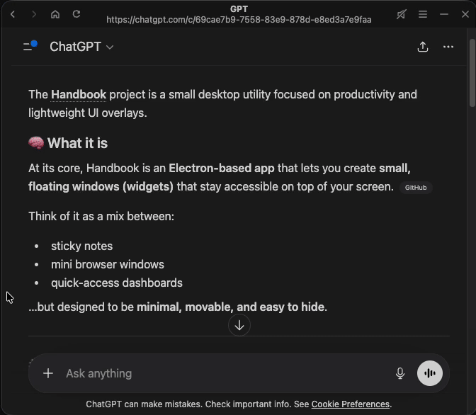
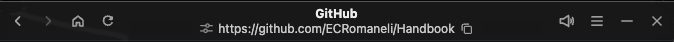
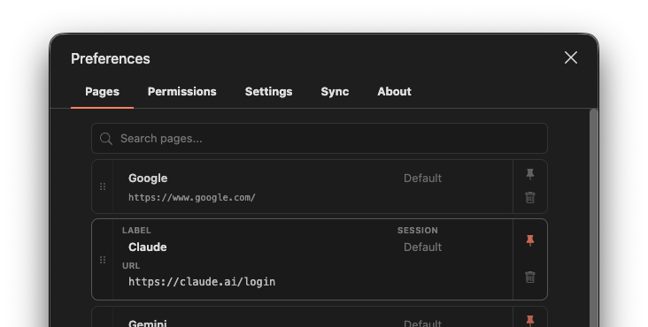
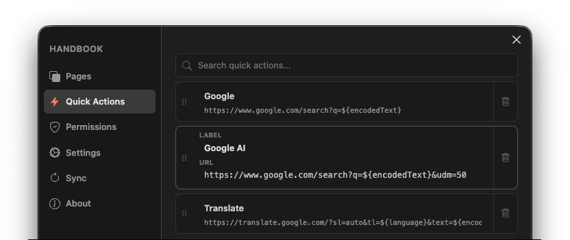
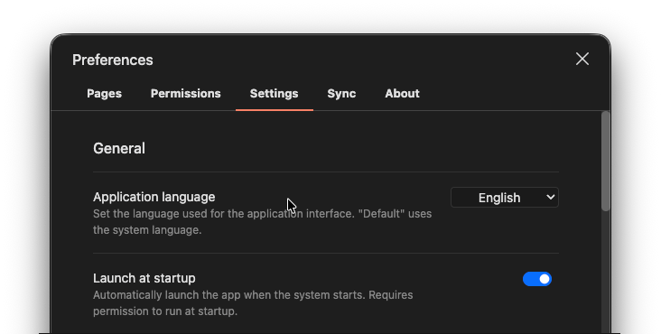
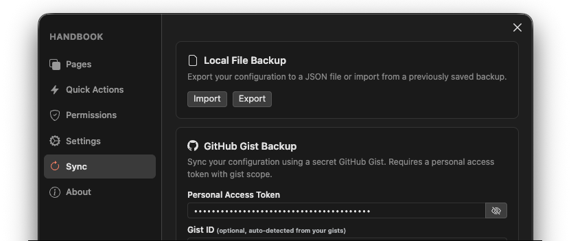
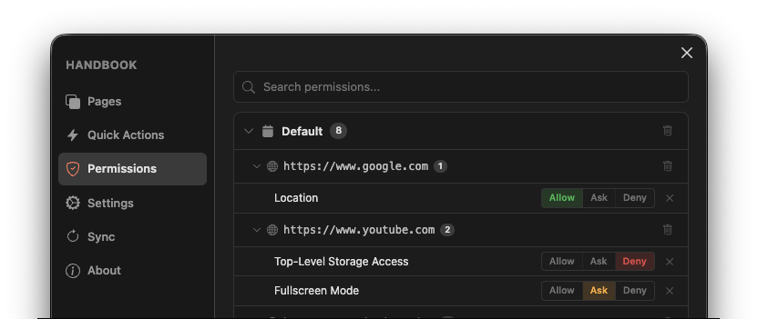
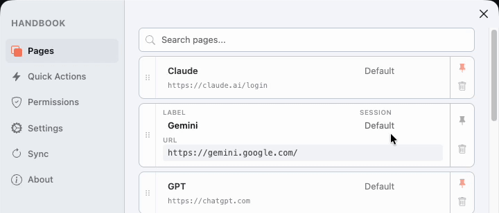

<p align='center'>
    <a href="https://github.com/ECRomaneli/handbook">
        
    </a>
</p>
<p align='center'>
    <b>Quick-access, always-on-top windows for the tools you use most.</b><br/>
    Stay focused. Stay productive.
</p>
<p align='center'>
    <a href="https://github.com/ECRomaneli/handbook/tags"></a>
    &nbsp;
    <a href="https://github.com/ECRomaneli/handbook/commits/master"></a>
    &nbsp;
    <a href="https://github.com/ECRomaneli/handbook/blob/master/LICENSE"></a>
    &nbsp;
    <a href="https://github.com/ECRomaneli/handbook/issues"></a>
</p>

---

## Why Handbook?

> *"Handbook was created to assist me in my development process, providing quick-access tools in the most efficient manner while coding. Some of my favorites include ChatGPT, Copilot, Gemini, Notion, WhatsApp, and even YouTube."*

Ever need to quickly check something — a chat message, an AI response, a doc — without leaving your workflow? Handbook gives you **lightweight, always-on-top windows** that float over everything, even fullscreen apps. One shortcut to show, one to hide. That's it.

### The Problem

- Switching to a browser kills your focus
- Too many open tabs waste RAM
- Alt-tabbing through windows is slow and disruptive

### The Solution

Handbook creates **single-purpose overlay windows** (called **Pages**) that are:

- **Always on top** — even over fullscreen content
- **Instantly toggleable** — show/hide with a global shortcut
- **Lightweight** — one Chromium instance per page, minimal RAM
- **Fully customizable** — opacity, size, position, shortcuts, and more

---

## Features

### System Tray Integration

Handbook lives in your system tray. Right-click to access pages, settings, and more. Click to toggle the current page.

<p align='center'>
    
</p>

### Always-On-Top Pages

Each page is a dedicated overlay window. Keep your AI open while coding, check WhatsApp without switching windows, or watch a tutorial on the side.

### Quick Menu (Default: <kbd>Cmd/Ctrl</kbd> + <kbd>P</kbd>)

Instantly switch between pages with a searchable command palette. Type to filter, press Enter to switch. No mouse needed.

<p align='center'>
    
</p>

### Transparent & Frameless Windows

Configure window opacity for focused and blurred states. Windows become semi-transparent when you're not interacting with them, letting you see your work underneath.

### Navigation Bar

A minimal 40px navigation bar provides essential controls: back, forward, reload, URL display, mute toggle, and find-in-page — without the bloat of a full browser. The navigation bar can also be disabled by turning it off in the "Preferences".

<p align='center'>
    
</p>

### Page Management

Add, reorder, and customize your pages. Set a URL, give it a label, assign a session, and choose whether the page should persist in memory when switching.

<p align='center'>
    
</p>

### Session Sharing

Pages with the same **Session ID** share cookies, cache, and login state. Log into Google once and access Gmail, Drive, and YouTube without re-authenticating. Use different sessions for personal and work accounts.


### Quick Actions

Create custom context menu shortcuts that open URLs with dynamic variables. Right-click any page to trigger actions like searching selected text on Google, translating content, or opening a link in an external service — all fully customizable.

Available variables include selected text, link URL, app locale, and more. Each variable can be used raw or URL-encoded in your URL templates.

<p align='center'>
    
</p>

### Window Customization

Fine-tune how your windows look and behave:

- **Position** — 9 preset screen positions (corners, edges, center)
- **Size** — Custom default width and height
- **Opacity** — Separate focus and blur opacity levels
- **Navbar** — Show or hide the navigation bar for a more minimal look
- **Shortcuts** — Global hotkeys to toggle visibility from anywhere
- **Shared bounds** — All pages share the same window size and position

<p align='center'>
    
</p>

### Sync & Backup

Export your configuration as a JSON file or sync it to a **GitHub Gist** for cloud backup and cross-device sync.

<p align='center'>
    
</p>

### Fine-Grained Permissions

Control permissions per page — clipboard, geolocation, camera, microphone, notifications, and more. Grant, deny, or prompt on a per-URL, per-session basis.

<p align='center'>
    
</p>

### Themes & Localization

- **Themes**: System, Light, and Dark
- **Languages**: English, German, Spanish, French, Italian, Portuguese (BR & PT), and Russian
- **Tray icon themes**: Light, Dark, and Gray

<p align='center'>
    
</p>


---

## Quick Start

1. **Download** the latest release for your OS from the [Releases page](https://github.com/ECRomaneli/Handbook/releases)
2. **Install** following the [Installation Guide](docs/INSTALLATION.md)
3. **Add pages** — The settings window opens automatically on first launch
4. **Configure a shortcut** — Set a global hotkey in Window Settings to toggle visibility
5. **Start using it** — Click the tray icon or press your shortcut to show/hide pages

> For detailed installation instructions for macOS, Linux, and Windows, see the **[Installation Guide](docs/INSTALLATION.md)**.

---

## Building from Source

```bash
git clone https://github.com/ECRomaneli/Handbook.git
cd Handbook
npm install
npm start
```

> For the full build guide, artifact creation, and distribution targets, see the **[Build Guide](docs/BUILD.md)**.

---

## Documentation

| Document | Description |
|----------|-------------|
| [Installation Guide](docs/INSTALLATION.md) | Detailed setup instructions for macOS, Linux, and Windows |
| [Configuration Guide](docs/CONFIGURATION.md) | Pages, window settings, sessions, permissions, and sync |
| [Build Guide](docs/BUILD.md) | Building from source and creating distribution artifacts |
| [Troubleshooting](docs/TROUBLESHOOTING.md) | Common issues and solutions |
| [Contributing](CONTRIBUTING.md) | How to contribute to Handbook |

---

## About App Signature

Handbook is open-source and contains no malicious code. However, the app is currently **not code-signed**, which may trigger security warnings on some operating systems. You can verify the source code and [build it yourself](docs/BUILD.md) for full code integrity assurance. See the [Troubleshooting Guide](docs/TROUBLESHOOTING.md) for instructions on bypassing OS security warnings.

---

## Author

Created by [Emerson Capuchi Romaneli](https://github.com/ECRomaneli) (@ECRomaneli).

## License

[MIT License](https://github.com/ECRomaneli/handbook/blob/master/LICENSE)
